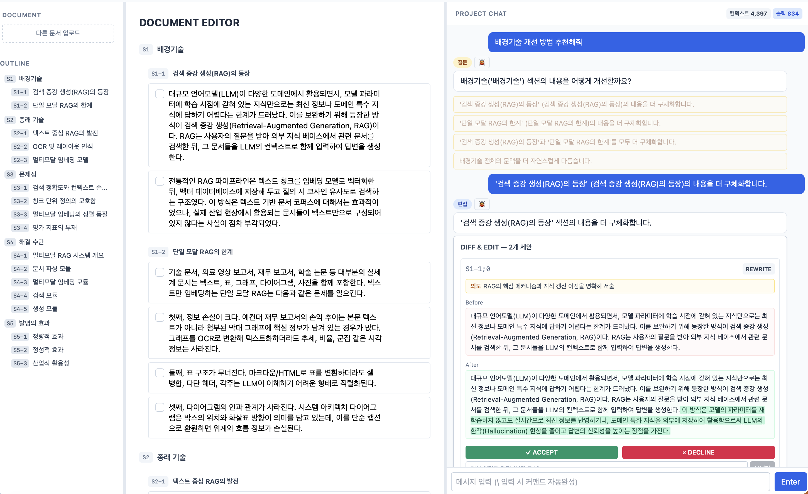
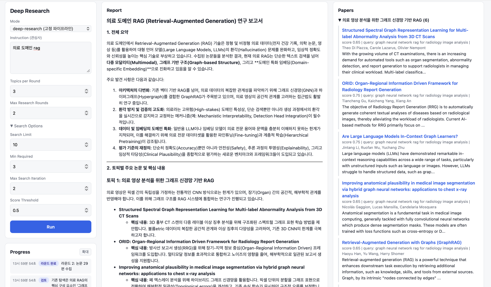
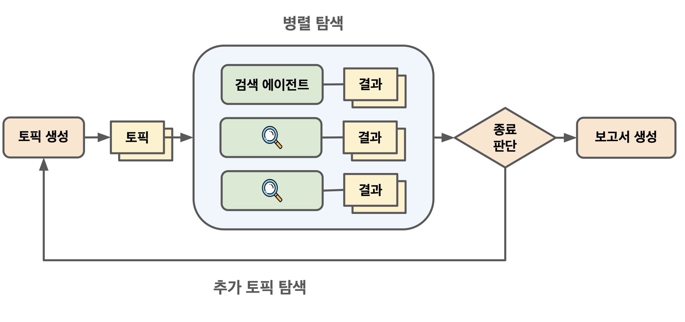

# research-playground
Collection of research related demos

| demo | updated | description |
| --- | --- | --- |
| [deep-research](./deep-research/) | 2026.07 | Simple Deep Research implemented using LangGraph, traced with datadog |
| [doc-editor](./doc-editor/) | 2026.06 | Chat-based Markdown document editor agent |
| [mm-paper-analyzer](./mm-paper-analyzer/) | 2026.04 | Multi-modal Paper (PDF) analyzer (doclayout, VLM, zvec) |

## Summary
### doc-editor
채팅 기반 Markdown 문서 편집 데모

### deep-research
Simple Deep Research implemented using LangGraph, traced with datadog

2 Different implementations:
- [Structured](./deep-research/backend/src/agent/graphs/deep_research/): Strictly node-based workflow like approach (Supervisor graph + Search subgraph)
- [ToolBased](./deep-research/backend/src/agent/graphs/deep_research_alt/): LLM tool-calling based supervisor-subagent approach (Supervisor agent calls search tool)

Demo:

Architecture:

