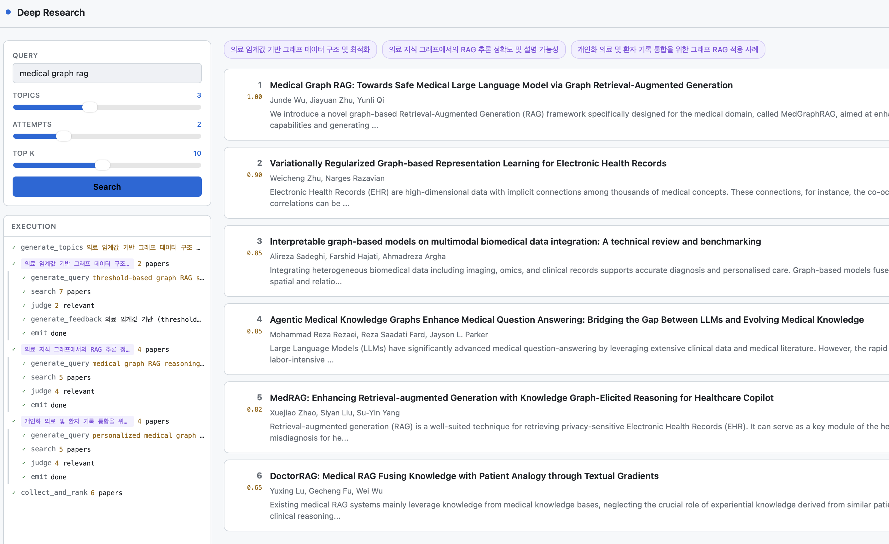

# research-playground
Collection of research related demos

| demo | created | description |
| --- | --- | --- |
| [doc-editor](./doc-editor/) | 2026.06 | Chat-based Markdown document editor agent |
| [mm-paper-analyzer](./mm-paper-analyzer/) | 2026.04 | Multi-modal Paper (PDF) analyzer (doclayout, VLM, zvec) |
| [deep-research](./deep-research/) | 2026.03 | Simple Deep Research implemented using LangGraph, traced with mlflow |

## Summary
### doc-editor
채팅 기반 Markdown 문서 편집 데모

### deep-research
Simple Deep Research implemented using LangGraph, traced with mlflow

