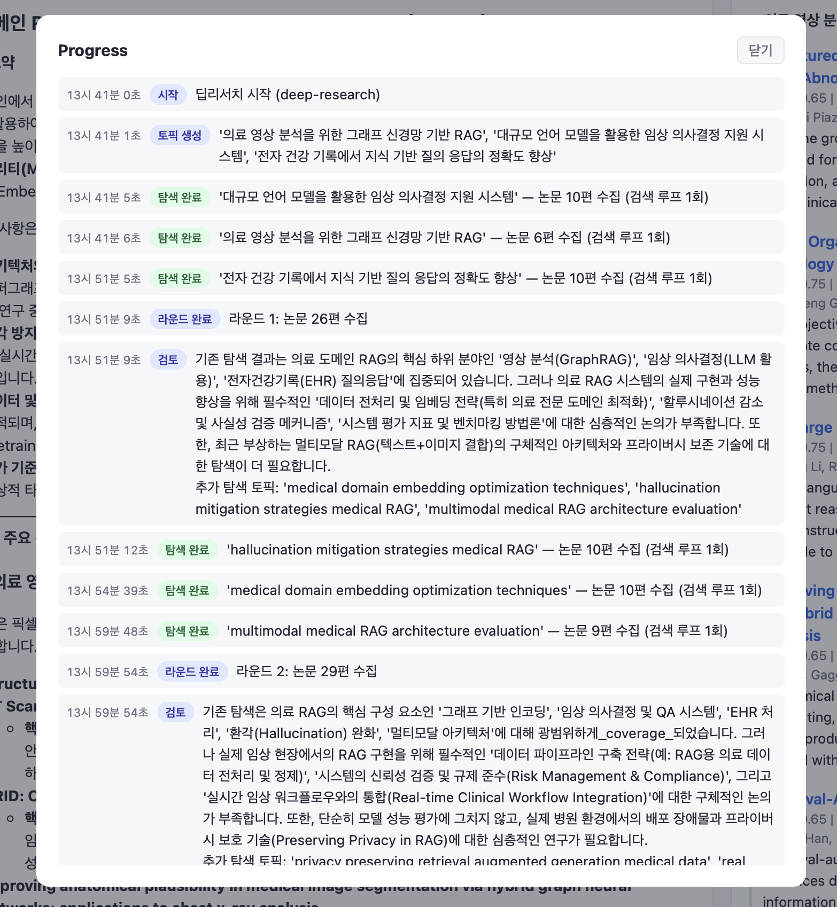

# deep-research-demo
Simple Deep Research implemented using LangGraph, traced with datadog

<table>
  <tr>
    <td align="center"><b>Demo</b></td>
    <td align="center"><b>Log</b></td>
  </tr>
  <tr>
    <td></td>
    <td></td>
  </tr>
</table>

## Implementation


I have made 2 different implementations of the architecture
- [Structured](./backend/src/agent/graphs/deep_research/): Strictly node-based workflow like approach (Supervisor graph + Search subgraph)
- [ToolBased](./backend/src/agent/graphs/deep_research_alt/): LLM tool-calling based supervisor-subagent approach (Supervisor agent calls search tool)


ToolBased implementation is much simpler, but it relies heavily on the model's tool calling & instruction following performance. Whereas Structured implementation is very rigid but is very predictable.


## Structured Approach
This approach comprises of 2 graph based workflows
- **Supervisor**: High-level loop that generates topics to search & judges whether to further conduct exploration
- **Search (Sub-agent)**: Low-level loop that searches within a single topic, but with multiple queries


**Details**
- high-level loop's condition is determined by an **explicit judge node `review`**
- low-level subagent is called in parallel (asyncio.gather) explicitly in `search` node

Main Graph pseudocode:

```
def should_continue(state: DeepResearchState) -> str:
    if should continue:
        return "search"
    return "finish"

## Node that calls search subagent in parallel & gather
class SearchNode(BaseNode):
  ...
  async def run(...):
    async def run_subagent(topic: str):
      result = await search_graph.ainvoke({"topic": topic})
      ...
    results = await asyncio.gather(*[run_subagent(topic) for topic in pending])
  ...
search_node = SearchNode()

b = StateGraph(DeepResearchState)

# Nodes
b.add_node("topic_generation", topic_generation_node)
b.add_node("search", search_node)
b.add_node("review", review_node)
b.add_node("aggregation", aggregation_node)
b.add_node("report", report_node)

# Edges
b.add_edge(START, "topic_generation")
b.add_edge("topic_generation", "search")
b.add_edge("search", "review")
b.add_conditional_edges(
    "review",
    should_continue,
    {"search": "search", "finish": "aggregation"}
)
b.add_edge("aggregation", "report")
b.add_edge("report", END)
return b.compile()
```

## Tool-Based Approach
This approach comprises of 2 components
- **Supervisor agent**: High-level ReAct LLM agent that calls the search subagent by tool-calling method
- **Search (Sub-agent)**: Low-level loop that searches within a single topic, but with multiple queries


**Details**
- High-level `review` is done implicitly by the model (decided by whether to do additional tool-calls)
- Search subagent is wrapped in langgraph tool function, returns `Command` with `update` in order to update the high-level state with retrieved papers

Main Graph pseudocode:

```
# Search tool
@tool
async def paper_search(topic: str, ...) -> Command:
  result = await search_graph.ainvoke({"topic": topic, "option": option}, config)
  ...
  return Command(
    update={
        "topics": [topic],
        "retrieved": final,
        "messages": [
            ToolMessage(
                content=f"토픽 '{topic}' 검색 결과 (논문 {len(final)}편):\n{papers_str}",
                tool_call_id=tool_call_id,
            )
        ],
    }
  )


# Supervisor Agent
supervisor_agent = create_agent(
    model=...,
    tools=[paper_search],
)


b = StateGraph(DeepResearchAltState)

# Nodes
# supervisor는 create_agent 서브그래프라 tool calling 루프를 내부에서 수행
b.add_node("supervisor", supervisor_node)
b.add_node("aggregation", aggregation_node)
b.add_node("report", report_node)

# Edges
b.add_edge(START, "supervisor")
b.add_edge("supervisor", "aggregation")
b.add_edge("aggregation", "report")
b.add_edge("report", END)
return b.compile()
```