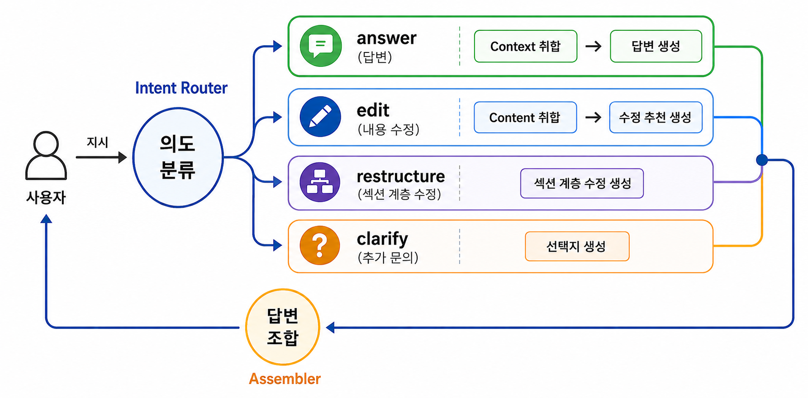

# doc-editor

채팅 기반 Markdown 문서 편집 데모 (2차 POC).


---

## 1. 개요

Markdown 문서를 채팅 방식으로 수정하는 기능을 개발한다.

- **문서 입력**: 고정 섹션 정의 → Markdown 파일 업로드 후 헤더 단위 파싱, 섹션 코드 자동 부여 (`S1`, `S1-1`, ...)
- **에이전트 구조**: 단일 LLM 호출 → LangGraph 멀티에이전트 (Orchestrator → 라우팅)

---

## 2. 문서 관리

섹션 계층 정보, 블록 단위의 문서 정보를 관리한다.

### 섹션 코드 부여

Markdown 헤더(`#`, `##`, ...) 기준으로 섹션을 분할하고, 순서와 깊이에 따라 계층 코드를 자동 부여한다:

```
# 배경기술        → S1
## 종래 기술      → S1-1
## 문제점         → S1-2
# 해결 수단       → S2
## 핵심 구성      → S2-1
### 세부 구성 A   → S2-1-1
```

### 블록 식별자

섹션 내부는 블록(text / equation / table) 단위로 관리하며, 블록 식별자는 `"<섹션코드>;<블록인덱스>"` 형식이다:

```
S1-2;0   → "문제점" 섹션의 첫 번째 블록
S2;3     → "해결 수단" 섹션의 네 번째 블록
```

### Document 모델

```python
class Block(BaseModel):
    type: Literal["text", "equation", "table"] = "text"
    content: str

class Section(BaseModel):
    meta: SectionMeta          # code, title, level, children
    blocks: list[Block]

class Document(BaseModel):
    sections: dict[str, Section]   # 섹션코드 → Section
    outline:  list[SectionMeta]    # 순서 보존 outline 트리
```

outline 예시:

```json
{
  "outline": [
    { "code": "S1",   "title": "배경기술",  "level": 1, "children": ["S1-1", "S1-2"] },
    { "code": "S1-1", "title": "종래 기술", "level": 2, "children": [] },
    { "code": "S1-2", "title": "문제점",    "level": 2, "children": [] },
    { "code": "S2",   "title": "해결 수단", "level": 1, "children": ["S2-1"] }
  ]
}
```


## 3. 에이전트 동작



사용자 지시에 대해서 아래 순서대로 요청을 처리한다:

1. **의도 분류 (Intent Router)**: Orchestrator가 사용자 메시지 + outline을 보고 인텐트 및 대상 섹션을 판단
2. **컨텍스트 수집**: 인텐트와 대상 섹션을 기반으로 실제 블록 내용을 로드할 섹션 코드 선정
3. **액션 실행**: 인텐트에 따라 서브에이전트로 라우팅
4. **답변 조합 (Assembler)**: 서브에이전트 결과를 합쳐 최종 응답 구성

| intent | 설명 | 라우팅 |
|---|---|---|
| `answer` | 문서 질문, 설명 요청 (수정 없음) | → answerer |
| `edit` | 블록 본문 수정/추가/치환 요청 | → editor |
| `restructure` | 섹션 이름·계층 변경 요청 (본문 변경 없음) | → restructurer |
| `clarify` | 요청이 모호하거나 사용자 선택이 필요할 때 | → clarifier (선택지 반환) |


에이전트 구현 패턴은 [docs/agents.md](./docs/agents.md)에 기록되어 있다.

### Intent Router 분기 판단 예시

```
"S1-2 섹션 보완해줘"           → edit   (명시적 변경 요청)
"최신 트렌드 반영해줘"          → edit   (search_results 없으면 editor가 처리)
"배경 섹션을 두 개로 나눠줘"    → restructure
"방금 뭐 바꿨어?"              → answer  (메타 질의 — 새 변경 아님)
"이 섹션 내용 요약해줘"         → answer
"어떤 방식으로 수정할까요?"     → clarify
```

### 3-1. 문서 맥락 포매팅

에이전트가 LLM을 호출할 때 문서 내용을 아래 포맷으로 직렬화하여 시스템 프롬프트에 주입한다.

**Outline 포매팅** (Intent Router / Context Collector 입력):

outline JSON을 들여쓰기 텍스트로 직렬화한다 (`level - 1`만큼 2칸 들여쓰기):

```
S1: 배경기술
  S1-1: 종래 기술
  S1-2: 문제점
S2: 해결 수단
  S2-1: 핵심 구성
```

**블록 본문 포매팅** (Edit Agent 입력):
```
### 문제점 (S1-2)
[S1-2;0] (text) 기존 접근 방식은 고정된 섹션 구조를 가정하여 ...
[S1-2;1] (text) 또한, 외부 정보를 참고하지 못하는 한계가 있다.

### 해결 수단 (S2)
[S2;0] (text) 본 발명은 Markdown 헤더를 파싱하여 ...
```

**선택된 블록 컨텍스트** (선택 시 추가):
```
## 선택된 블록 (이 블록들만 수정)
S1-2;0, S1-2;1
```


## 4. 백↔프론트 통신

### 4-1. 문서 정보 전달

매 `/api/chat` 요청에 Document 전체와 선택된 블록 ref 목록을 포함한다:

```json
{
  "project_id": "abc123",
  "messages": [...],
  "document": {
    "sections": {
      "S1-2": {
        "meta": { "code": "S1-2", "title": "문제점", "level": 2, "children": [] },
        "blocks": [
          { "type": "text", "content": "기존 접근 방식은..." }
        ]
      }
    },
    "outline": [...]
  },
  "selected": ["S1-2;0", "S1-2;1"]
}
```

응답 형식:

```json
{
  "message": { "role": "assistant", "content": "'문제점' 섹션 첫 번째 블록을 보완했습니다." },
  "intent": "edit",
  "edits": {
    "S1-2;0": [
      { "action": "REWRITE", "value": "새 본문 내용...", "summary": "한계점을 더 구체적으로 보완" }
    ]
  },
  "outline_actions": [],
  "clarify_options": []
}
```

수정 액션 종류:

| 액션 | 필드 | 설명 |
|---|---|---|
| `REWRITE` | `value` | 블록 전체를 새 본문으로 교체 |
| `REPLACE` | `source`, `target` | 블록 내 substring 치환 |
| `INSERT` | `value`, `value_type` | 해당 블록 바로 아래 새 블록 삽입 |

### 4-2. 채팅 히스토리

히스토리는 프론트엔드에서 누적 관리하며 매 요청마다 전체 `messages` 배열로 전달한다.

`ChatMessage`는 단순 텍스트가 아닌 **이전 제안과 사용자 반응 메타데이터**를 함께 담는다. 서버의 `to_lc_messages()`는 이를 LLM이 이해할 수 있는 태그 텍스트로 직렬화한 뒤 LangChain `HumanMessage` / `AIMessage`로 감싸 전달한다.

#### 직렬화 템플릿

**어시스턴트 메시지** (`_format_assistant_content`):

```
[ASSISTANT · {intent_label}] {content}

[제시된 블록 수정 제안]          ← edit_proposals 있을 때
  #{n} [{action}] {target_desc} → {status}
      · 의도: {summary}
      · 내용: {content}

[제시된 섹션 구조 변경]          ← outline_proposals 있을 때
  #{n} [{action}] {target_desc} → {status}
      · 의도: {summary}

[제시된 선택지]                  ← clarify_options 있을 때
  ① {option_0}
  ② {option_1}
```

- `intent_label`: `편집 제안` / `섹션 구조 변경 제안` / `사용자에게 질문` / `답변`
- `status`: `수락` / `거절` / `대기` / `직접 지시("{instruction}")`

**유저 메시지** (`_format_user_content`):

```
[USER] {content}                              ← 일반 입력

[USER · 선택지 ① 채택] {content}             ← clarify 선택지를 고른 경우
```

#### 흐름별 직렬화 예시

**edit 흐름** — 제안 수락 후 추가 요청:

```
[ASSISTANT · 편집 제안] '문제점' 섹션 첫 번째 블록을 보완했습니다.

[제시된 블록 수정 제안]
  #1 [REWRITE] '문제점' 섹션 1번째 블록 → 수락
      · 의도: 기존 한계를 더 구체적으로 보완
      · 내용: 기존 접근 방식은 고정된 섹션 구조를 가정하여 범용 문서 적용이 어렵다...

[USER] 두 번째 블록도 같은 방향으로 보완해줘
```

**edit 흐름** — 일부 거절 후 직접 지시:

```
[ASSISTANT · 편집 제안] 두 개의 수정안을 제안합니다.

[제시된 블록 수정 제안]
  #1 [REWRITE] '종래 기술' 섹션 1번째 블록 → 수락
      · 의도: 선행 기술의 한계점 명시
      · 내용: 기존 특허 문서 편집 시스템은 ...
  #2 [INSERT] '종래 기술' 섹션 1번째 블록 → 직접 지시("표 형태로 바꿔줘")
      · 의도: 비교 내용을 새 블록으로 추가

[USER] 방금 수정된 내용 기반으로 요약 섹션도 만들어줘
```

**clarify 흐름** — 선택지 제시 후 채택:

```
[ASSISTANT · 사용자에게 질문] 어떤 방향으로 수정할까요?

[제시된 선택지]
  ① 현재 내용을 더 구체적으로 풀어쓰기
  ② 기술 용어를 일반 독자 수준으로 쉽게 바꾸기

[USER · 선택지 ① 채택] (선택지 채택)
```

**restructure 흐름** — 섹션 구조 변경 제안 수락:

```
[ASSISTANT · 섹션 구조 변경 제안] 섹션 구조를 조정했습니다.

[제시된 섹션 구조 변경]
  #1 [RENAME] '종래 기술' 섹션 → 수락
      · 의도: 제목을 더 명확하게 변경
  #2 [ADD] '배경기술' 섹션 하위 → 거절
      · 의도: 관련 법규 섹션 신규 추가

[USER] 수락한 섹션의 본문도 새 제목에 맞게 다듬어줘
```


## 실행

```bash
# 백엔드 (로컬, hot reload)
cd server && ./run-local.sh        # http://localhost:5000

# 백엔드 (Docker)
docker build -t doc-edit-server server/
docker run --rm -p 5000:5000 --env-file server/.env doc-edit-server

# 프론트엔드
cd frontend && npm run dev          # http://localhost:9051
```

자세한 에이전트 설계는 [`AGENTS.md`](./AGENTS.md) 참조.
